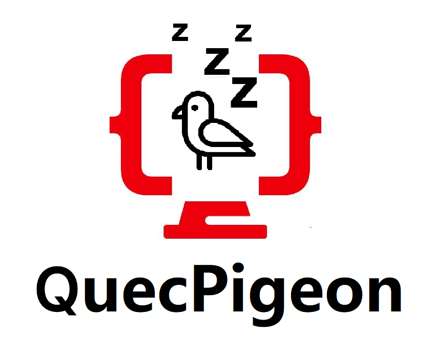

# QuecPigeon Docs

Unofficial documentation, just to make it faster and easier for users to use QuecPython for functional testing and product development.

非官方文档，旨在帮助用户更快、更方便地使用 QuecPython 进行功能测试和产品开发。

In this version of the documents, we have adjusted the organization and layout of the content, making it more suitable for presentation in the form of a book and easier for users to read.

在这一版本的文档中，我们调整了内容的组织和布局，使其更适合以书籍的形式呈现，更便于用户阅读。

Due to limited ability, there are inappropriate parts in the document, please criticize and correct.

能力所限，文档中存在的不当之处，还望批评指正。

