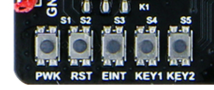

.. 网页标题

.. .. title:: 主页

.. Metadata

.. meta::
   :description: BC25_QuecPython_EVB_V1.0/V1.2 快速参考手册
   :keywords: QuecPython, quecpython, BC25, bc25, NB, nb, MicroPython, micropython, 开发板, 核心板, EVB, evb

.. 默认语法高亮

.. highlight:: python

开发板硬件功能简介
=========================================

本节主要针对 BC25_QuecPython_EVB_V1.0 和 BC25_QuecPython_EVB_V1.2 两款开发板附带的器件和硬件接口功能进行简要介绍。通过本节的介绍，用户可以初步了解 GPIO、ADC 等常用外设功能在 QuecPython 中的基础特性和使用注意事项。

本节的部分内容涉及到 QuecPython 环境中运行的程序代码。建议用户根据后续章节完成 QuecPython 开发环境搭建后再参考该部分内容。

BC25 模块
~~~~~~~~~~~~~~~~~~~~~~~~~~~~~~~~~~~~~~~~

BC25 是一款高性能、低功耗的 NB-IoT 无线通信模块，其尺寸仅为 17.7 mm × 15.8 mm × 2.2 mm，能最大限度地满足终端设备对小尺寸模块产品的需求，同时有效帮助客户减小产品尺寸并优化产品成本。

BC25 在设计上兼容移远通信 GSM/GPRS 系列的 M26 模块，同时兼容 NB-IoT 系列 BC26 和 BC28 模块，方便客户快速、灵活的进行产品设计和升级。

BC25 提供丰富的外部接口和协议栈，同时可支持中国移动 OneNET 和中国电信物联网开放平台，为客户的应用提供极大的便利。

关于 BC25 模块的详细信息，请联系官方销售人员或代理商索取相关资料。

电源和功耗
~~~~~~~~~~~~~~~~~~~~~~~~~~~~~~~~~~~~~~~~

开发板供电
----------------------------------------

BC25_QuecPython_EVB_V1.0 和 BC25_QuecPython_EVB_V1.2 开发板支持通过板载的 USB Type-C 接口进行供电，也可通过板载的外部供电排针（J3，下图红框位置）进行供电。

.. figure:: ./media/power_supply.png
   :align: center
   :alt: 供电排针位置
   :scale: 50 %

   板载的外部供电排针

当使用 USB 接口连接电脑并对开发板进行供电时，建议用户选择质量可靠的 USB Type-C 数据线缆将开发板连接至电脑主机的 USB 3.0 接口。

在大部分情况下，USB 接口可以满足开发板的整体供电需求。在少数特殊情况下，用户可将电源切换开关（K1，下图红框位置）从 USB 侧切换到 DC 侧，然后使用外部直流电源通过供电排针为开发板进行 5V 直流供电。建议外部电源的最大输出电流不低于 1 A。

   板载的电源切换开关

开机
----------------------------------------

在为开发板接入正常供电后，可以通过将 BC25 模块的 7 号引脚（PWRKEY）拉低到地至少 1 s 的方式使其开机。

在开发板上，按键 S1（PWK）与 BC25 模块 PWRKEY 引脚直接相连。当按键被按下时，该引脚将被拉低到地。在为开发板接入正常供电后，可以通过按下按键 S1 至少 1 s 使得模块开机。模块开机后，PWRKEY 引脚将保持低电平状态。

如果希望实现模块上电自动开机，可以将 PWRKEY 引脚直接连接到 GND。在开发板上，PWRKEY 和 GND 通过自动开机排针（J4，下图红框位置）引出，因而只需使用跳线帽或杜邦线将 J4 短接即可。

   板载的自动开机排针

关机
----------------------------------------

BC25 模块支持通过直接断开供电的方式进行关机，也支持通过执行 AT 指令或 QuecPython 函数的方式进行关机（软关机）。

.. code-block:: python3
   :caption: 在 QuecPython 中控制模块关机
   :linenos:

    # 引入电源功能库
    from misc import Power

    # 调用关机函数
    Power.powerDown()

睡眠与唤醒
----------------------------------------

开发板上搭载的 BC25 模块在出厂时默认烧录了标准 AT 固件，具有自动进入深睡眠模式 [1]_ 的特性。若开发板在使用时未插入 SIM 卡，或在搜网失败等情况下，模块会在短时间内自动进入深睡眠模式。

在深睡眠模式下，CPU 电源会被断开、程序停止运行、上下行数据无法处理、串口不再响应，模块处于类似关机的状态（VDD_EXT 引脚电压为 0 V，芯片内部仅 RTC 继续运行）。故对于处于深睡眠模式的模块，用户无法正常与之交互，亦无法烧录固件。

当模块处于深睡眠模式下时，将模块的 19 号引脚（PSM_EINT）拉低到地产生的电平下降沿将使得模块从深睡眠模式中被唤醒。

在开发板上，按键 S3（EINT）与 BC25 模块 PSM_EINT 引脚直接相连。当按键被按下时，该引脚将被拉低到地。当 BC25 模块处于深睡眠模式时，可以通过按下按键 S3 以唤醒模块。

.. note:: 

   .. [1] 关于模块工作模式的详细信息，以及控制模块进入睡眠模式以降低功耗的方法，请参考《Quectel_BC25系列_QuecOpen_硬件设计手册》《QuecPython_BC25_低功耗应用》和 NB-IoT 网络的相关资料，本文不做赘述。

串口
~~~~~~~~~~~~~~~~~~~~~~~~~~~~~~~~~~~~~~~~

BC25 模块设有三个串口：主串口、调试串口和辅助串口。其中辅助串口可在 QuecPython 开发中被作为普通串口使用，以连接其他串口外设。

主串口
----------------------------------------

在使用传统 AT 指令方式进行开发时，主串口可用于 AT 指令通信和数据传输，默认波特率为 9600 bps。在使用 QuecPython 方式进行开发并烧录相应固件后，主串口用于 Python 用户交互（REPL），默认波特率为 57600 bps。

当主串口切换开关（K3，下图红框位置）拨至“排针”一侧时，用户可自行使用单独的 USB 转 TTL 串口模块通过开发板上排针 J6 的第 4 和第 5 脚连接到主串口。主串口本身为 1.8 V 电压域，在引出到排针时已通过板载的双向电压电平转换器转换为 3.3 V。

   板载的主串口切换开关

当主串口切换开关拨至“USB”一侧时，用户可使用 USB Type-C 数据线通过板载的 USB 转串口芯片连接到主串口。在 Microsoft Windows 操作系统中，当连接正常时，主串口在设备管理器中显示为 Standard COM Port（对于 BC25_QuecPython_EVB_V1.0）或 SERIAL-B（对于 BC25_QuecPython_EVB_V1.2）。

调试串口
----------------------------------------

通过日志查看工具，调试串口可用于查看底层日志信息以进行软件调试。调试串口也可以用于软件升级（固件烧录）。调试串口的默认波特率为 921600 bps。

当调试串口切换开关（K2，下图红框位置）拨至“排针”一侧时，用户可自行使用单独的 USB 转 TTL 串口模块 [2]_ 通过开发板上排针 J6 的第 6 和第 7 脚连接到调试串口。调试串口本身为 1.8 V 电压域，在引出到排针时已通过板载的双向电压电平转换器转换为 3.3 V。

   板载的调试串口切换开关

当调试串口切换开关拨至“USB”一侧时，用户可使用 USB Type-C 数据线通过板载的 USB 转串口芯片连接到调试串口。在 Microsoft Windows 操作系统中，当连接正常时，调试串口在设备管理器中显示为 Enhanced COM Port（对于 BC25_QuecPython_EVB_V1.0）或 SERIAL-A（对于 BC25_QuecPython_EVB_V1.2）。

.. note::

   .. [2] 用户务必预先确认所使用的 USB 转串口模块支持 921600 或更高波特率，否则可能导致通信和固件烧录失败。

辅助串口
----------------------------------------

在使用传统 AT 指令方式进行开发时，辅助串口可用于 AT 指令通信和数据传输，默认波特率为 9600 bps。在使用 QuecPython 方式进行开发并烧录相应固件后，用户可将辅助串口初始化为一般的通用串口 UART1，用于连接各类串口外设并通信。

用户可自行使用单独的 USB 转 TTL 串口模块通过开发板上排针 J5 的第 7 和第 8 脚连接到辅助串口。辅助串口本身为 1.8 V 电压域，在引出到排针时已通过板载的双向电压电平转换器转换为 3.3 V。

.. code-block:: python3
   :caption: 在 QuecPython 中使用串口
   :linenos:

    # 引入串口功能库
    from machine import UART

    # 初始化辅助串口
    # 波特率 115200，数据位 8，无校验位，停止位 1，无硬件流控
    myuart = UART(UART.UART1, 115200, 8, 0, 1, 0)

    # 检查串口的接收缓冲区内是否存在数据
    buff_len = myuart.any()
    # 如果有则读取
    if buff_len > 0:
        input_data = myuart.read(buff_len)
        print(input_data.decode())

    # 串口发送数据
    output_data = b"Hello, world"
    myuart.write(output_data)

    # 使用完后，及时关闭串口
    myuart.close()

串口的更多使用方法，请参阅 `在线 Wiki`_ 的 machine.UART 章节。

按键
~~~~~~~~~~~~~~~~~~~~~~~~~~~~~~~~~~~~~~~~~~~~

BC25_QuecPython_EVB_V1.0 和 BC25_QuecPython_EVB_V1.2 开发板搭载了 5 个按键，其中 3 个为功能按键，2 个为用户自定义按键。

   板载按键

开机按键（PWK）
---------------------------------------------

当为开发板接入电源并正常供电后，可以通过按下开机按键至少 1 秒钟的方式使得 BC25 模块开机。具体原理和细节可参考前文的“电源和功耗”章节。

复位按键（RST）
---------------------------------------------

复位按键与 BC25 模块的 15 号引脚（RESET）直接相连。按键按下时，该引脚将被拉低到地。可以通过按下复位按键至少 1 秒钟使得模块复位。

复位功能通常用于在模块中已有程序运行时，若希望烧录新的程序（固件），在烧录开始前需要拉低 RESET 引脚以结束程序阻塞状态。具体用法请参阅官方资料或联系技术支持人员。

唤醒按键（EINT）
---------------------------------------------

当 BC25 模块处于软关机（通过 AT 指令或 QuecPython 函数控制的关机）或深睡眠（Deep Sleep）模式时，按下该按键产生的电平下降沿将使得模块被唤醒。具体原理和细节可参考前文的“电源和功耗”章节。

自定义按键（KEY1 和 KEY2）
---------------------------------------------

KEY1 和 KEY2 通过板载的双向电压电平转换器与 BC25 模块的 32 和 33 号引脚相连。在使用 QuecPython 开发时，这两个引脚分别对应 GPIO15 和 GPIO16，可用于测试 GPIO 电平读取和外部中断等功能。具体用法本文不做赘述，用户可参阅 `在线 Wiki`_ 的 machine.Pin 和 machine.ExtInt 两节。

指示灯
~~~~~~~~~~~~~~~~~~~~~~~~~~~~~~~~~~~~~~~~~~~~

BC25_QuecPython_EVB_V1.0 和 BC25_QuecPython_EVB_V1.2 开发板搭载了 2 个 LED 指示灯，分别用于指示供电和网络状态。

   板载指示灯

电源指示灯（POW）
---------------------------------------------

电源指示灯用于指示供电情况。当开发板接入外部供电且 LDO 电路工作正常时，电源指示灯即亮起。

需要注意的是，电源指示灯只能用于指示开发板是否存在供电，与 BC25 模块的工作状态无关。该灯亮起后，用户仍需使用前文“电源和功耗”一节中介绍的方法对 BC25 模块进行开机。

网络指示灯（NET）
---------------------------------------------

网络指示灯受 BC25 模块的 16 号引脚（NETLIGHT）电平的控制。

在使用传统 AT 指令开发时，可通过 ``AT+QLEDMODE=1`` 指令开启网络指示功能，通过指示灯闪烁状态判断网络连接情况。

在使用 QuecPython 进行开发时，由于部分版本的固件没有内置或未开启网络指示功能，不建议用户直接通过指示灯亮灭来判断模块的工作状态。

此外，在使用 QuecPython 进行开发时，16 号引脚可被作为 GPIO5 使用。用户可以通过控制 GPIO 的电平高低来改变指示灯的亮灭状态。

GPIO
~~~~~~~~~~~~~~~~~~~~~~~~~~~~~~~~~~~~~~~~~~~~

在使用 QuecPython 开发时，BC25 模块共有 18 个 GPIO 可供用户使用。BC25_QuecPython_EVB_V1.0 和 BC25_QuecPython_EVB_V1.2 开发板通过两侧的排针引出了其中的 15 个。具体的功能复用和分布情况请参考前文的“IO 功能概览”一节。

GPIO 的使用方法较为简单。

.. code-block:: python3
   :caption: 在 QuecPython 中使用 GPIO
   :linenos:

    # 首先引入功能库
    from machine import Pin
    import utime as time

    # 初始化一个 GPIO 对象
    # 输出模式，无上下拉，低电平
    mygpio = Pin(Pin.GPIO5, Pin.OUT, Pin.PULL_DISABLE, 0)

    # 亮 2 秒，熄 1 秒，重复 10 次
    for i in range(10):
        mygpio.write(1)
        time.sleep(2)
        mygpio.write(0)
        time.sleep(1)

    # 读取引脚电平
    mygpio.read()

受 MicroPython 脚本运行原理和底层 RTOS 任务优先级调度等因素的影响，单条 MicroPython 语句（如上文中的 ``mygpio.read()`` ）执行速度较慢，且每次执行所消耗的时间不等。因此，GPIO 功能不适合用于脉冲信号检测和 PWM 输出等类似场合。

BC25 的 GPIO 还可用于触发外部中断。关于 GPIO 和中断的详细用法，请参阅 `在线 Wiki`_ 的 machine.Pin 和 machine.ExtInt 章节。

需要注意的是，由于 BC25_QuecPython_EVB_V1.0 和 BC25_QuecPython_EVB_V1.2 开发板在将引脚引出到外部排针时使用了双向电压电平转换器，因此在不传输信号时，引脚电平默认处于上拉状态。在进行电平检测等操作时应额外注意。

ADC
~~~~~~~~~~~~~~~~~~~~~~~~~~~~~~~~~~~~~~~~~~~~

BC25 模块提供了一个 10-bit 分辨率的模数转换输入接口，测量范围为 0 - 1.8 V。

在 BC25_QuecPython_EVB_V1.0 开发板上，ADC 被引出到排针时，通过电阻分压，输入电压范围扩大为 0 - 3.6 V。

在 BC25_QuecPython_EVB_V1.2 开发板上，ADC 与模块供电（VBAT）相连接。如需测量外部电压，需手动去除电阻 R32。

在 QuecPython 中，可以通过如下所示的方法使用 ADC 读取外部电压值。

.. code-block:: python3
   :caption: 在 QuecPython 中使用 ADC
   :linenos:

    # 引入 ADC 功能库
    from misc import ADC

    # 创建 ADC 对象
    myadc = ADC()

    # ADC 功能初始化
    myadc.open()

    # 读取通道 0 的电压值
    volt = myadc.read(ADC.ADC0)
    print(volt)

    # 使用完后，及时关闭 ADC 功能
    myadc.close()   

关于 ADC 功能的详细用法，请参阅 `在线 Wiki`_ 的 misc.ADC 章节。

受 MicroPython 脚本运行原理和底层 RTOS 任务优先级调度等因素的影响，单条 MicroPython 语句（如上文中的 ``myadc.read()`` ）执行速度较慢，且每次执行所消耗的时间不等。因此，ADC 功能仅适用于电压大小的测量，不适合用于脉冲计数或高频信号采集等场合。

|I2C| 和 SPI
~~~~~~~~~~~~~~~~~~~~~~~~~~~~~~~~~~~~~~~~~~~~

BC25 模块提供 2 路 |I2C| 接口和 1 路 SPI 接口，可用于连接基于 |I2C| 和 SPI 总线的外部传感器、显示屏等设备。

BC25_QuecPython_EVB_V1.0 和 BC25_QuecPython_EVB_V1.2 开发板已将 2 路 |I2C| 和 1 路 SPI 接口全部引出并转换为 3.3 V 电平，具体位置请参考前文的“IO 功能概览”章节。

|I2C| 和 SPI 作为双向通信总线，需要双方设备实现正常的发送和应答才能完成通信过程。因此，本文档不提供具体的代码示例。

关于 |I2C| 和 SPI 在 QuecPython 中的使用方法，请参阅 `在线 Wiki`_ 的 machine.I2C 和 machine.SPI 章节。

在开发 |I2C| 和 SPI 功能时，强烈建议用户使用逻辑分析仪等工具以提高调试的效率。

.. 统一管理超链接

.. _在线 Wiki: https://python.quectel.com/wiki/#/

.. 替换选项

.. |I2C| replace:: I\ :sup:`2`\ C