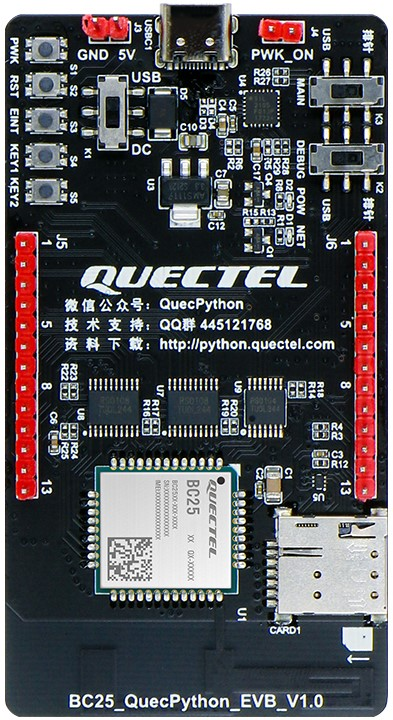

.. 网页标题

.. .. title:: 主页

.. Metadata

.. meta::
   :description: BC25_QuecPython_EVB_V1.0/V1.2 快速参考手册
   :keywords: QuecPython, quecpython, BC25, bc25, NB, nb, MicroPython, micropython, 开发板, 核心板, EVB, evb

.. 默认语法高亮

.. highlight:: python

设备概述
=================================================

开发板简介
~~~~~~~~~~~~~~~~~~~~~~~~~~~~~~~~~~~~~~~~~~~~~~~~~~

BC25_QuecPython_EVB_V1.0 和 BC25_QuecPython_EVB_V1.2 是基于移远 BC25 NB-IoT 无线通信模块设计的开发板。开发板可以通过 NB-IoT 无线电通信协议（3GPP Rel-13 和 3GPP Rel-14）与移动网络运营商基础设备建立通信，来调试和开发基于 NB-IoT 的物联网应用。

   BC25_QuecPython_EVB_V1.0 开发板

开发板引出了 BC25 模块的大部分引脚并进行了电平转换，便于用户连接各种外设。同时采用了 PCB 内置天线的设计，并搭载了 USB 转串口芯片，用户仅需准备一根 USB Type-C 接口的数据线即可完成大部分开发工作。

BC25_QuecPython_EVB_V1.0 和 BC25_QuecPython_EVB_V1.2 两款开发板的绝大部分功能完全一致。

BC25_QuecPython_EVB_V1.0 和 BC25_QuecPython_EVB_V1.2 开发板支持标准 AT 指令、QuecOpen（CSDK）和 QuecPython 开发方式。本文档基于 QuecPython 开发方式展开介绍。如需获取标准 AT 或 CSDK 相关的技术支持，请联系官方销售人员或本地代理商。

设备特性
~~~~~~~~~~~~~~~~~~~~~~~~~~~~~~~~~~~~~~~~~~~~~~~~~~

下表描述了 BC25_QuecPython_EVB_V1.0 和 BC25_QuecPython_EVB_V1.2 开发板在基于 QuecPython 进行开发时所具备的一些器件资源和功能特性。

模块基本信息
---------------------------------------------------

.. list-table::
    :widths: auto
    :header-rows: 1
    :align: center

    * - 功能属性
      - 说明
    * - SKU
      - QTMB0018AA
    * - 模块型号
      - BC25PA-04-STD，基于 RDA8908A 平台
    * - RAM [1]_
      - 4 MB，用户可用空间约 512 KB
    * - Flash [1]_
      - 4 MB，用户可用空间约 128 KB
    * - 无线工作频段
      - B3 / B5 / B8
    * - 最大发射功率
      - 23 dBm ± 2 dB
    * - 模块工作温度
      - | 正常工作温度：-25 ℃ ~ +75 ℃
        | 扩展工作温度：-40 ℃ ~ +85 ℃
        | 存储温度：-40 ℃ ~ +90 ℃
    * - 模块功耗 [2]_
      - | 深睡眠状态：约 6.0 μA
        | 空闲状态（DRX = 2.56 s，ECL0）：约 1.2 mA
        | 射频发射状态（23 dBm）：约 300 mA

硬件外设资源
---------------------------------------------------

.. list-table::
    :widths: auto
    :header-rows: 1
    :align: center

    * - 名称
      - 数量 [3]_
      - 说明
    * - 串口
      - x3
      - 仅 1 路可用于 QuecPython 开发
    * - GPIO
      - x15
      - 其中 10 路与 |I2C| 等其他功能复用引脚
    * - |I2C|
      - x2
      -    
    * - SPI
      - x1
      - 仅可作为主机
    * - ADC
      - x1
      - BC25_QuecPython_EVB_V1.2 开发板无法直接使用

板载器件和接口功能
---------------------------------------------------

.. list-table::
    :widths: auto
    :header-rows: 1
    :align: center

    * - 名称
      - 说明
    * - 供电
      - | USB 接口：典型供电电压 5.0 V
        | 供电排针：典型供电电压 5.0 V
        | 可通过电源切换开关选择供电方式
    * - USB 接口
      - | 通过串口转接芯片与模块主串口和调试串口相连接
        | 可用于数据传输、软件调试和固件升级
    * - USIM 接口
      - | 可插入 1.8 V 或 3.0 V 的外部 USIM 卡
        | USIM 卡需支持 NB-IoT 网络制式
    * - 按键
      - | 开机按键（PWK）：用于 BC25 模块开机
        | 复位按键（RST）：用于对 BC25 模块进行复位
        | 唤醒按键（EINT）：用于唤醒处于休眠或软关机模式下的 BC25 模块
        | 自定义按键（KEY1 和 KEY2）：可用于用户测试
    * - 电源切换开关
      - 用于切换开发板供电方式
    * - 串口切换开关
      - | 用于切换串口连接方式
        | 连接到 USB 或引出到板载排针
    * - 指示灯
      - | 电源指示灯（POW）：指示开发板供电状态
        | 网络指示灯（NET）：指示网络连接和通信状态

.. rubric是不构成章节索引的标题

.. .. rubric:: 备注

.. note:: 

  .. [1] 用户可用空间指模块烧入 QuecPython 固件后，内部剩余的、用户可直接使用的 RAM 和文件系统空间。不同版本、不同类型的 QuecPython 固件，用户可用空间可能存在差异，请以实际情况为准。

  .. [2] 模块功耗受外围电路、工作环境和用户程序逻辑的影响较大，表中仅为特定条件下测得的理想值，且未将外围电路器件的功耗计算在内。开发板的实际功耗请以实测为准。建议针对开发板的供电不低于 5V 1A。

  .. [3] 指开发板通过排针等接口引出的、可直接使用的资源数量。模块本身实际的资源数量可能大于表中所示的值。

.. 替换选项

.. |I2C| replace:: I\ :sup:`2`\ C
