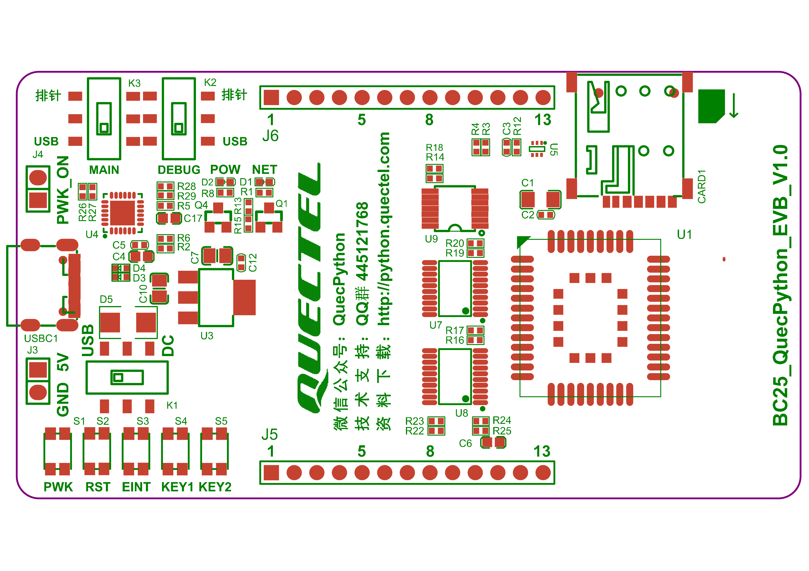

.. 网页标题

.. .. title:: 主页

.. Metadata

.. meta::
   :description: BC25_QuecPython_EVB_V1.0/V1.2 快速参考手册
   :keywords: QuecPython, quecpython, BC25, bc25, NB, nb, MicroPython, micropython, 开发板, 核心板, EVB, evb

.. 默认语法高亮

.. highlight:: python

板载器件和接口概览
===========================================

设备功能框图
~~~~~~~~~~~~~~~~~~~~~~~~~~~~~~~~~~~~~~~~~~~~~

电源逻辑
---------------------------------------------

.. mermaid:: ./media/power.mmd

开发板功能关系图
---------------------------------------------

.. mermaid:: ./media/board_diag.mmd

器件和接口分布
~~~~~~~~~~~~~~~~~~~~~~~~~~~~~~~~~~~~~~~~~~~~~

下图展示了主要功能器件和接口在 BC25_QuecPython_EVB_V1.0 和 BC25_QuecPython_EVB_V1.2 开发板上的位置。

   BC25_QuecPython_EVB_V1.0 开发板丝印示意图

..     :widths: 20 30 10 15
.. list-table::
    :widths: auto
    :header-rows: 1
    :align: center

    * - 器件类型
      - 型号 / 功能
      - 数量
      - 位号
    * - NB-IoT 无线通信模块
      - BC25PA-04-STD
      - 1
      - U1
    * - USB 转双串口芯片
      - | CP2105
        | CH342 [1]_
      - 1
      - U4
    * - Nano-SIM 自弹卡座
      -  
      - 1
      - CARD1
    * - USB Type-C 接口
      -  
      - 1
      - USBC1
    * - 按键
      - | 开机按键（PWK）
        | 复位按键（RST）
        | 唤醒按键（EINT）
        | 自定义按键 1（KEY1）
        | 自定义按键 2（KEY2）
      - 5
      - | S1
        | S2
        | S3
        | S4
        | S5
    * - 电源切换开关
      -
      - 1
      - K1
    * - 串口切换开关
      - | 主串口（MAIN）切换开关
        | 调试串口（DEBUG）切换开关
      - 2
      - | K3
        | K2
    * - LED 灯
      - | 电源指示灯（POW）
        | 网络指示灯（NET）
      - 2
      - | D2
        | D1
    * - IO 排针
      - | 13-Pin
        | 15-Pin [2]_
      - 2
      - J5, J6
    * - 双向电压电平转换器
      -  
      - 3
      - U7, U8, U9
    * - 外部供电排针
      -  
      - 1
      - J3
    * - 上电自动开机排针
      -  
      - 1
      - J4
    * - 板载天线
      -  
      - 1
      -   

.. note::

  .. [1] BC25_QuecPython_EVB_V1.0 开发板搭载 CP2105 芯片，BC25_QuecPython_EVB_V1.2 开发板搭载 CH342 芯片。

  .. [2] BC25_QuecPython_EVB_V1.0 开发板的 J5 和 J6 排针为 13-Pin，BC25_QuecPython_EVB_V1.2 开发板的 J5 和 J6 排针为 15-Pin。

