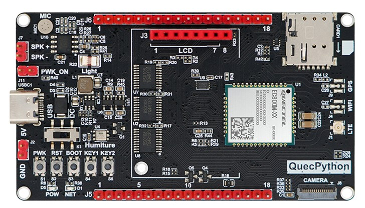

.. 网页标题

.. .. title:: 主页

.. Metadata

.. meta::
   :description: EC800X_QuecPython_EVB_V1.0/V1.1 快速参考手册
   :keywords: QuecPython, quecpython, ec800n, EC800N, EC800M, ec800m, EC800G, ec800g, MicroPython, micropython, 开发板, 核心板, EVB, evb

.. 默认语法高亮

.. highlight:: python

设备概述
=================================================

开发板简介
~~~~~~~~~~~~~~~~~~~~~~~~~~~~~~~~~~~~~~~~~~~~~~~~~~

EC800X_QuecPython_EVB_V1.0 和 EC800X_EVB_V1.1 是基于移远 EC800N、EC800M 和 EC800G 无线通信模块（以下统称 EC800X 系列模块）设计的开发板。开发板可以通过 LTE Cat.1 无线电通信协议与移动网络运营商基础设备建立通信，来调试和开发基于 4G 无线通信技术的物联网应用。

   搭载 EC800M-CN 模块的 EC800X_QuecPython_EVB_V1.0 开发板

开发板引出了 EC800X 系列模块的部分引脚并进行了电平转换，便于用户连接各种外设。同时集成了 SIM 卡槽、天线座等接口和温湿度传感器、光敏电阻等常用传感器，用户仅需准备一根 USB Type-C 接口的数据线即可完成大部分开发工作。

EC800X_QuecPython_EVB_V1.0 和 EC800X_EVB_V1.1 两款开发板的大部分功能完全一致。

EC800X_QuecPython_EVB_V1.0 和 EC800X_EVB_V1.1 开发板支持标准 AT 指令、QuecOpen（CSDK）和 QuecPython 开发方式。本文档基于 QuecPython 开发方式展开介绍。如需获取标准 AT 或 CSDK 相关的技术支持，请联系官方销售人员或本地代理商。

设备特性
~~~~~~~~~~~~~~~~~~~~~~~~~~~~~~~~~~~~~~~~~~~~~~~~~~

下表描述了 EC800X_QuecPython_EVB_V1.0 和 EC800X_EVB_V1.1 开发板在基于 QuecPython 进行开发时所具备的一些器件资源和功能特性。

当前在售的开发板共有 4 种类型，用户可根据货号（SKU）或开发板搭载的模块型号进行区分。

模块基本信息
---------------------------------------------------

.. csv-table::
   :file: ./media/basic_info.csv
   :widths: 25, 15, 15, 15, 15
   :header-rows: 1
   :align: center

.. note:: 

    .. [1] 可用空间指模块烧入 QuecPython 固件后，内部剩余的、用户可直接使用的 RAM 和文件系统空间。不同版本、不同类型的 QuecPython 固件，用户可用空间可能存在差异，请以实际情况为准。

射频和功耗特性
-------------------------------------

.. list-table::
    :widths: auto
    :header-rows: 1
    :align: center

    * - 功能属性
      - 说明
    * - 供电电压
      - 典型值: 3.8 V
    * - 无线工作频段   
      - | LTE-FDD：B1 / B3 / B5 / B8
        | LTE-TDD：B34 / B38 / B39 / B40 / B41
        | GNSS [2]_ ：GPS/BDS/Galileo/GLONASS
    * - 最大发射功率
      - | LTE-FDD 频段：Class 3 (23 dBm ± 2 dB)
        | LTE-TDD 频段：Class 3 (23 dBm ± 2 dB)
    * - | LTE 最大通信速率
        | （下行 / 上行）
      - | LTE-FDD：10 Mbps / 5 Mbps
        | LTE-TDD：8.96 Mbps / 3.1 Mbps
    * - 模块工作温度
      - | 正常工作温度：-25 ℃ ~ +75 ℃
        | 扩展工作温度：-40 ℃ ~ +85 ℃
        | 存储温度：-40 ℃ ~ +90 ℃
    * - 模块功耗 [3]_
      - | 关机模式：约 30 ~ 40 μA
        | 睡眠模式：约 1 ~ 3 mA
        | 空闲模式：约 10 ~ 30 mA
        | 最大功率发射：约 500 ~ 600 mA

.. note:: 

    .. [2] 内置 GNSS 为可选功能。当前，仅有搭载 EC800MCNGA 型号模块的开发板支持内置 GNSS 功能。

    .. [3] 模块功耗受外围电路、工作环境和用户程序逻辑的影响较大，表中仅为特定条件下测得的理想值，且未将外围电路器件的功耗计算在内。开发板的实际功耗请以实测为准。建议针对开发板的供电不低于 5V 2A。

